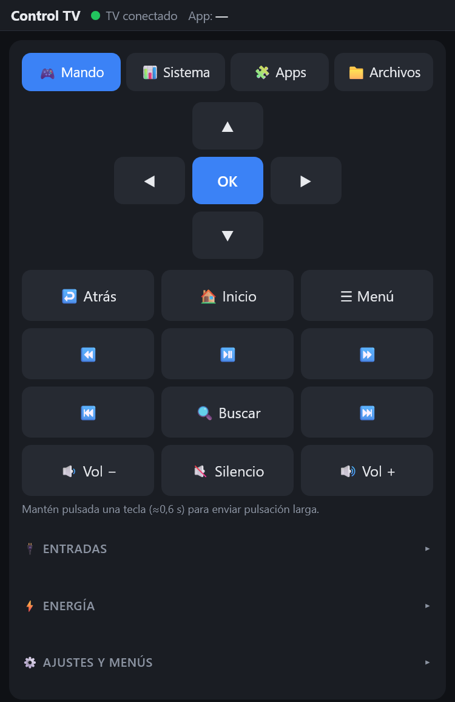

# TV Remote (ADB web remote) · Control remoto web para Android TV

[Español](#español) · [English](#english)

<p align="center"></p>

---

## Español

Interfaz web para ver y controlar un Android TV (probado en un Xiaomi Mi TV con Android TV 10) a través de ADB por red. Un pequeño servidor en Python traduce las peticiones HTTP a comandos `adb`, y una página HTML sin dependencias hace de mando.

### Funciones

- **Mando:** D-pad, Atrás/Inicio/Menú, multimedia, volumen, entradas HDMI, energía (despertar, dormir, reiniciar); pulsación larga (≈0,6 s).
- **Pantalla en vivo:** captura del TV cada 2 s; un clic sobre la imagen toca ese punto.
- **Ajustes rápidos** agrupados (Wi-Fi, sonido, apps, almacenamiento, actualización, desarrollador…).
- **Escribir texto** en el TV y usar el teclado del PC como mando.
- **Lanzador de apps** con nombres e iconos (emoji).
- **Sistema:** RAM, disco, tiempo encendido, firmware; limpieza de memoria y cachés; animaciones; salvapantallas; grabación de pantalla; instalación de APK.
- **Apps:** listado de paquetes con acciones (deshabilitar, habilitar, desinstalar…). Los paquetes críticos están protegidos.
- **Archivos:** explorador de `/sdcard`, descarga y subida.
- **Responsive:** diseño para móvil con bloques plegables, tema claro/oscuro automático.

### Requisitos

- Windows (los scripts de inicio son `.ps1`/`.bat`; el servidor en sí es multiplataforma).
- [Python 3.10+](https://www.python.org/) y `pip install -r requirements.txt` (solo Pillow).
- [ADB (platform-tools)](https://developer.android.com/tools/releases/platform-tools) en el `PATH`.
- Un servidor web estático opcional (por ejemplo Apache de XAMPP). No es necesario: el propio servidor Python sirve la interfaz en `/`.
- En el TV: **Opciones de desarrollador → Depuración USB/ADB por red** activada.

### Uso rápido

```powershell
pip install -r requirements.txt
adb connect 192.168.1.50:5555          # IP de tu TV
.\start-tv-remote.ps1 -Tv 192.168.1.50:5555
```

O haz doble clic en `start-tv-remote.bat`. Se abre <http://localhost/tv-remote/> (si tienes Apache sirviendo esta carpeta desde `htdocs`) o usa directamente <http://127.0.0.1:8080/>.

Parámetros de `start-tv-remote.ps1`: `-Tv` (IP:puerto del TV), `-Port` (por defecto 8080), `-Lan`, `-NoBrowser`.
Sin el script: `python server.py --tv 192.168.1.50:5555 [--port 8080] [--lan]`.

### Usarlo desde el móvil (modo LAN)

```powershell
.\start-tv-remote.ps1 -Lan
```

El servidor escucha en toda la red y **exige un token** que se imprime al arrancar. Abre en el móvil (misma Wi-Fi):

```
http://<IP-de-tu-PC>:8080/?t=<TOKEN>
```

Si no carga, permite Python (puerto 8080) en el Firewall de Windows para el perfil de tu red, y revisa que el router no aísle los dispositivos Wi-Fi.

### Seguridad

> ⚠️ **Esta herramienta da control total del TV por ADB.** Úsala solo en tu red local y bajo tu responsabilidad. Ver [SECURITY.md](SECURITY.md).

- Por defecto solo escucha en `127.0.0.1`, rechaza cualquier `Host` que no sea `localhost`/`127.0.0.1` (anti DNS rebinding) y comprueba que el `Origin` sea el mismo equipo.
- En modo `--lan` el token es aleatorio y cambia en cada arranque, pero el tráfico **no está cifrado** (HTTP). Úsalo solo en una red de confianza.
- Esta herramienta da control total del TV por ADB (instalar/desinstalar apps, leer archivos). No la expongas a internet.

### Estructura

| Archivo | Descripción |
|---|---|
| `server.py` | API HTTP (stdlib + Pillow) que llama a `adb` |
| `index.html` | Interfaz de una sola página (sin dependencias) |
| `start-tv-remote.ps1` / `.bat` | Conecta ADB, libera el puerto e inicia el servidor |
| `requirements.txt` | Dependencias de Python |

### Limitaciones conocidas

- El envío de texto solo admite ASCII (sin tildes ni ñ).
- El endpoint `/info` puede tardar ~6 s en TVs lentos.
- Los iconos de apps son emojis definidos en `APP_NAMES` (`index.html`); las apps nuevas aparecen con su nombre de paquete.

---

## English

A web interface to view and control an Android TV (tested on a Xiaomi Mi TV running Android TV 10) over networked ADB. A small Python server translates HTTP requests into `adb` commands, and a dependency-free HTML page acts as the remote.

### Features

- **Remote:** D-pad, Back/Home/Menu, media, volume, HDMI inputs, power (wake, sleep, reboot); long press (~0.6 s).
- **Live screen:** TV screenshot every 2 s; clicking the image taps that point.
- **Grouped quick settings** (Wi-Fi, sound, apps, storage, update, developer…).
- **Text entry** on the TV and PC keyboard as a remote.
- **App launcher** with friendly names and emoji icons.
- **System:** RAM, disk, uptime, firmware; memory/cache cleanup; animation scale; screensaver; screen recording; APK install.
- **Apps:** package list with actions (disable, enable, uninstall…). Critical packages are protected.
- **Files:** `/sdcard` browser, download and upload.
- **Responsive:** mobile layout with collapsible blocks, automatic light/dark theme.

### Requirements

- Windows (start scripts are `.ps1`/`.bat`; the server itself is cross-platform).
- [Python 3.10+](https://www.python.org/) and `pip install -r requirements.txt` (Pillow only).
- [ADB (platform-tools)](https://developer.android.com/tools/releases/platform-tools) on your `PATH`.
- An optional static web server (e.g. XAMPP's Apache). Not required: the Python server also serves the UI at `/`.
- On the TV: **Developer options → USB/network ADB debugging** enabled.

### Quick start

```powershell
pip install -r requirements.txt
adb connect 192.168.1.50:5555          # your TV's IP
.\start-tv-remote.ps1 -Tv 192.168.1.50:5555
```

Or double-click `start-tv-remote.bat`. It opens <http://localhost/tv-remote/> (if Apache serves this folder from `htdocs`), or use <http://127.0.0.1:8080/> directly.

`start-tv-remote.ps1` parameters: `-Tv` (TV IP:port), `-Port` (default 8080), `-Lan`, `-NoBrowser`.
Without the script: `python server.py --tv 192.168.1.50:5555 [--port 8080] [--lan]`.

### Using it from your phone (LAN mode)

```powershell
.\start-tv-remote.ps1 -Lan
```

The server listens on the whole network and **requires a token** printed at startup. On your phone (same Wi-Fi) open:

```
http://<YOUR-PC-IP>:8080/?t=<TOKEN>
```

If it does not load, allow Python (port 8080) in Windows Firewall for your network profile, and check that your router does not isolate Wi-Fi clients.

### Security

> ⚠️ **This tool gives full control of the TV over ADB.** Use it only on your own local network and at your own risk. See [SECURITY.md](SECURITY.md).

- By default it only listens on `127.0.0.1`, rejects any `Host` other than `localhost`/`127.0.0.1` (anti DNS rebinding) and checks that the request `Origin` is the same host.
- In `--lan` mode the token is random and changes on every start, but traffic is **not encrypted** (plain HTTP). Use it on a trusted network only.
- This tool gives full ADB control of the TV (install/uninstall apps, read files). Never expose it to the internet.

### Layout

| File | Description |
|---|---|
| `server.py` | HTTP API (stdlib + Pillow) that calls `adb` |
| `index.html` | Single-page UI (no dependencies) |
| `start-tv-remote.ps1` / `.bat` | Connects ADB, frees the port, starts the server |
| `requirements.txt` | Python dependencies |

### Known limitations

- Text entry supports ASCII only (no accents or ñ).
- `/info` can take ~6 s on slow TVs.
- App icons are emojis defined in `APP_NAMES` (`index.html`); new apps show their package name until added.

---

## License / Licencia

MIT — see [LICENSE](LICENSE).
